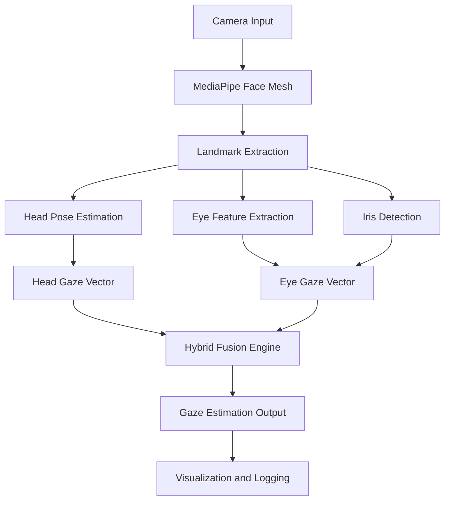

# 👁️ Gaze Tracking System

A hybrid **Gaze Tracking System** that captures and analyzes human eye gaze using **OpenCV** and **MediaPipe**.  
It supports both **manual point calibration** and **automatic calibration**, combining **head pose** and **eye gaze** data for accurate gaze estimation.

---

## 🚀 Features

- **Real-time gaze tracking** with MediaPipe Face Mesh.
- **Head pose integration** for enhanced accuracy.
- **Eye gaze estimation** using iris and eye landmarks.
- **9-point calibration** (blink-based or OK button-based).
- **Screen boundary mapping** for precise screen coordinates.
- **Normal smoothing** for stable gaze points.
- **Blink detection** for calibration triggers.
- **System monitoring** (CPU, RAM usage) integrated in logs.
- **Logging** in JSON, CSV, and TXT formats.
- **Visualization** overlay with gaze points, crosshair, calibration targets, and warnings.
- Adjustable **cursor sensitivity** for smoothing responsiveness.

---

## 🧩 System Architecture



---

## 🛠️ Installation

### Step 1 – Clone the Repository
```bash
git clone https://github.com/yourusername/gaze-tracking-system.git
cd gaze-tracking-system
```

### Step 2 – Create Virtual Environment (Optional)
```bash
python -m venv venv
# Activate it
venv\Scripts\activate        # On Windows
source venv/bin/activate     # On macOS/Linux
```

### Step 3 – Install Dependencies
```bash
pip install -r requirements.txt
```

---

## 📦 Requirements

Your `requirements.txt` should contain:
```
opencv-python
mediapipe
numpy
```

**Optional (for data logging and analysis):**
```
pandas
matplotlib
scikit-learn
scipy
```

---

## ▶️ Usage

### Run the Gaze Tracker
```bash
python gaze_tracker.py
```

**###Calibration Tips (Critical for Accuracy!)**

Sit ~50–70 cm from camera
Good, even lighting on your face (avoid backlight)
Look directly at each yellow circle
Keep head as still as possible during calibration
In blink mode: one clear blink per point when ready
In OK mode: look + click the green "OK" button

### Keyboard Controls

| Key   | Function                               |
| ----- | ------------------------------------   |
| **q** | Quit                                   |
| **s** | Set screen boundaries                  |
| **c** | Start point calibration                |
| **r** | Reset calibration                      |
| **b** | Switch calibration to BLINK method     |
| **o** | Switch calibration to OK button method |
| **+** | Increase sensitivity                   |
| **-** | Decrease sensitivity                   |
| **l** | Toggle logging                         |


---

## 🧠 Working Principle

1. **Face Detection** — MediaPipe detects 3D facial landmarks and iris positions.  
2. **Head Pose Estimation** — Calculates head orientation using selected landmarks.  
3. **Eye Gaze Vector** — Derived from iris center and eye corners.  
4. **Hybrid Fusion** — Merges head and eye gaze for stable tracking.  
5. **Calibration** — Maps gaze direction to screen coordinates.  
6. **Visualization** — Displays tracking overlay and calibration points.  

---

## 🗂️ Folder Structure

```
📁 gaze-tracking-system
│
├── gaze_tracker.py           # Main script
├── requirements.txt          # Dependencies
├── README.md                 # Documentation
└── gaze_logs/                # auto-created logs (JSON, CSV, TXT)
    ├── gaze_data_20251120_185918.csv        
    ├── gaze_data_20251120_185918.json         
    ├── gaze_data_20251120_185918.txt  
```

---

## 🌟 Future Enhancements

- 🔥 Heatmap visualization for gaze concentration  
- 📈 Real-time analytics dashboard  
- 🧩 Deep learning–based gaze refinement  
- 💻 Web-based gaze tracking (WebGazer.js integration)  
- 🎯 Eye-controlled UI navigation  

---

## 🧑‍💻 Author

**BalaJi**  

---

## 📄 License

Licensed under the **MIT License**.  
You may use, modify, and distribute this project with attribution.

---

## 🙌 Acknowledgements

- [MediaPipe by Google](https://developers.google.com/mediapipe)  
- [OpenCV](https://opencv.org/)  
- [WebGazer.js](https://webgazer.cs.brown.edu/) – concept inspiration  

---

⭐ **If you found this project useful, please give it a star on GitHub!**
