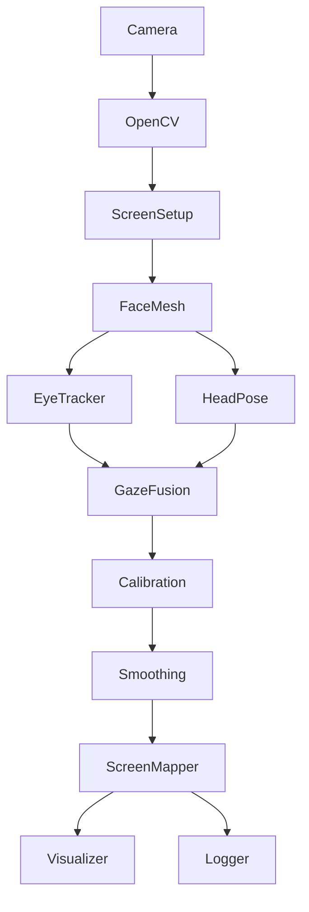

# 👁️ Eye Gaze Tracking System

A real-time, high-accuracy **Eye Gaze Tracking System** built using **Python, OpenCV, and MediaPipe FaceMesh**.  
The system tracks eye and head movements, fuses them for stability, applies calibration using regression models, and maps gaze points to screen coordinates for cursor control and visualization.

---

## 🚀 Features

- 📷 Real-time video capture using OpenCV  
- 🧠 Face, eye & iris landmark detection with MediaPipe FaceMesh  
- 👁️ Eye gaze estimation from iris displacement  
- 🧭 Head pose estimation using facial landmarks  
- 🔀 Gaze fusion (eye + head) for improved robustness  
- 🎯 **Calibration system**
  - Linear Regression
  - Polynomial Regression (degree 3)
  - 9-point calibration support  
- 🗺️ **Mandatory screen boundary setup** (4-corner Screen Mapper)  
- 🪶 Gaze smoothing to reduce jitter  
- 🖥️ Live visualization of gaze point and system status  
- 📝 Logging of gaze data, CPU & RAM usage (CSV/JSON/TXT)  
- ⚡ Modular, extensible architecture

---

## 🧩 System Architecture


```mermaid
graph TD
    Camera --> OpenCV
    OpenCV --> ScreenSetup
    ScreenSetup --> FaceMesh
    FaceMesh --> EyeTracker
    FaceMesh --> HeadPose
    EyeTracker --> GazeFusion
    HeadPose --> GazeFusion
    GazeFusion --> Calibration
    Calibration --> Smoothing
    Smoothing --> ScreenMapper
    ScreenMapper --> Visualizer
    ScreenMapper --> Logger
```
## 🛠️ Tech Stack

**Language:**  
- Python 3.x  

**Libraries & Tools:**  
- OpenCV – real-time computer vision  
- MediaPipe – face & iris landmark detection  
- NumPy – numerical computations  
- Pandas – data handling & logging  
- Scikit-learn – regression models for calibration  
- SciPy – mathematical & spatial transformations  
- psutil – CPU & memory monitoring  
- threading – parallel processing  
- logging – structured system logs  

---

## 🛠️ Installation

### Step 1 – Clone the Repository
```bash
git clone https://github.com/yourusername/gaze-tracking-system.git
cd gaze-tracking-system
```

### Step 2 – Create Virtual Environment (Optional)
```bash
python -m venv venv
# Activate it
venv\Scripts\activate        # On Windows
source venv/bin/activate     # On macOS/Linux
```

### Step 3 – Install Dependencies
```bash
pip install -r requirements.txt
```

---


## ▶️ Usage

### Run the Gaze Tracker
```bash
python gaze_tracker.py
```

## 🗺️ Startup Flow

1. 📷 **Camera opens**

2. 🗺️ **Screen Mapper setup**  
   Click 4 corners in order: Top-Left (TL) → Top-Right (TR) → Bottom-Right (BR) → Bottom-Left (BL)

3. 🎯 **Calibration** (optional but recommended)  
   - Linear Regression for basic mapping  
   - Polynomial Regression (degree 3) for non-linear correction  
   - 9-point calibration grid for better accuracy  
   Calibration maps raw gaze values → actual screen coordinates.

4. 👁️ **Real-time gaze tracking begins**

⚠️ **Note:** Screen setup is mandatory before tracking starts.

---

## 🖥️ Output

- Live gaze point overlaid on camera feed  
- Cursor / UI movement based on gaze  
- Log files include:
  - Gaze data  
  - Calibration values  
  - CPU & RAM usage  
  - Timestamps  

Logs are saved in **CSV/JSON/TXT** formats inside the `logs/` directory.

## 🎯 Calibration Tips (Critical for Accuracy!)

- Sit ~50–70 cm from the camera  
- Ensure good, even lighting on your face (avoid backlight)  
- Look directly at each yellow circle  
- Keep your head as still as possible during calibration  

**Calibration Modes:**

### Option A – Blink Mode (Completely Hands-Free)
1. Press **b** (default)  
2. Look at the yellow pulsing circle  
3. Blink once clearly when ready  
4. Wait for all 20 samples → automatically moves to next point  
5. Repeat for all 9 points  

### Option B – OK Button Mode
1. Press **o**  
2. Look at the circle  
3. Click the green **OK** button when ready  
4. Repeat for all 9 points  

> Calibration takes ~60–90 seconds. Enjoy smooth gaze control!

---

## 🗺️ Set Your Screen Boundaries (Highly Recommended!)
1. Press **s** → Click these 4 corners in exact order:  
   - Top-Left of your actual screen  
   - Top-Right  
   - Bottom-Right  
   - Bottom-Left  

> This ensures the gaze cursor lands exactly where you're looking, even on laptops or external monitors.

---

## ⌨️ Controls During Tracking
- Move your eyes → cursor follows smoothly  
- Adjust speed with **+** and **-** keys (1 = slowest, 10 = fastest)  
- Press **l** to toggle logging on/off  
- Press **q** anytime to quit and auto-save logs


### Keyboard Controls

| Key   | Function                               |
| ----- | ------------------------------------   |
| **q** | Quit                                   |
| **s** | Set screen boundaries                  |
| **c** | Start point calibration                |
| **r** | Reset calibration                      |
| **b** | Switch calibration to BLINK method     |
| **o** | Switch calibration to OK button method |
| **+** | Increase sensitivity                   |
| **-** | Decrease sensitivity                   |
| **l** | Toggle logging                         |


---

## 🧠 Working Principle

1. **Face Detection** — MediaPipe detects 3D facial landmarks and iris positions.  
2. **Head Pose Estimation** — Calculates head orientation using selected landmarks.  
3. **Eye Gaze Vector** — Derived from iris center and eye corners.  
4. **Hybrid Fusion** — Merges head and eye gaze for stable tracking.  
5. **Calibration** — Maps gaze direction to screen coordinates.  
6. **Visualization** — Displays tracking overlay and calibration points.  

---

## Common Issues & Warnings (Please Read Before Reporting Bugs)

| Issue / Warning                                   | Cause                                                      | Fix / Note                                                                 |
|---------------------------------------------------|------------------------------------------------------------|-----------------------------------------------------------------------------|
| Cursor jumps all over the place                   | You skipped calibration or didn’t set screen corners (`s`) | Always press `s` → click 4 corners → press `c` → calibrate!                |
| Calibration never advances / stuck on point 1     | Using Blink mode but blinking too fast or too weakly       | Blink once clearly and wait 2–3 seconds per point                         |
| "OK" button does nothing                          | You are in Blink mode (`b`)                                Press `o` first to switch to OK-button mode                                  |
| Gaze is offset (e.g. center looks bottom-right)   | Screen corners not set or set in wrong order               Press `s` and click exactly: Top-Left → Top-Right → Bottom-Right → Bottom-Left |
| Very low confidence (0.00) all the time           | Wearing thick glasses, very low light, or extreme angle    | Improve lighting, remove heavy glasses, face camera straight                 |
| Program freezes or uses 100% CPU                   | Running on very old laptop or wrong camera resolution       | Try lowering camera resolution in code (e.g. 640×480)                       |
| Logs folder not created                            | No write permission in folder                               | Run terminal/Python as administrator or move script to Desktop/Documents    |

## 🗂️ Folder Structure

```
📁 gaze-tracking-system
│
├── gaze_tracker.py           # Main script
├── requirements.txt          # Dependencies
├── README.md                 # Documentation
└── gaze_logs/                # auto-created logs (JSON, CSV, TXT)
    ├── gaze_data_20251120_185918.csv        
    ├── gaze_data_20251120_185918.json         
    ├── gaze_data_20251120_185918.txt
    ├── gaze_debugger.log
```

---

## 🧪 Accuracy Notes

Accuracy depends on:

- Calibration quality  
- Lighting conditions  
- Camera resolution and placement  
- Head movement vs eye movement balance  

> "Accuracy mainly depends on calibration quality and relative iris displacement, not just landmark detection."

---

## 🔮 Future Enhancements

- Deep learning–based gaze estimation  
- Multi-user support  
- Better blink and gesture controls  
- GUI for calibration and settings  
- Cross-platform cursor integration


---

## 🧑‍💻 Author

**BalaJi**  

---

## 📄 License

Licensed under the **MIT License**.  
You may use, modify, and distribute this project with attribution.

---

## 🙌 Acknowledgements

- [MediaPipe by Google](https://developers.google.com/mediapipe)  
- [OpenCV](https://opencv.org/)  
- [WebGazer.js](https://webgazer.cs.brown.edu/) – concept inspiration  

---

⭐ **If you found this project useful, please give it a star on GitHub!**
