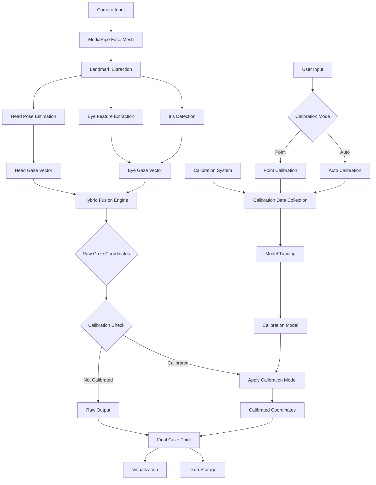

```mermaid
flowchart TD
    A[Camera Input] --> B[MediaPipe Face Mesh]
    
    B --> C[Landmark Extraction]
    
    C --> D[Head Pose Estimation]
    C --> E[Eye Feature Extraction]
    C --> F[Iris Detection]
    
    D --> G[Head Gaze Vector]
    E --> H[Eye Gaze Vector]
    F --> H
    
    G --> I[Hybrid Fusion Engine]
    H --> I
    
    I --> J{Raw Gaze Coordinates}
    
    J --> K{Calibration Check}
    
    K -->|Calibrated| L[Apply Calibration Model]
    K -->|Not Calibrated| M[Raw Output]
    
    L --> N[Calibrated Coordinates]
    
    M --> O[Final Gaze Point]
    N --> O
    
    O --> P[Visualization]
    O --> Q[Data Storage]
    
    R[Calibration System] --> S[Calibration Data Collection]
    S --> T[Model Training]
    T --> U[Calibration Model]
    U --> L
    
    V[User Input] --> W{Calibration Mode}
    W -->|Point| X[Point Calibration]
    W -->|Auto| Y[Auto Calibration]
    
    X --> S
    Y --> S
```
