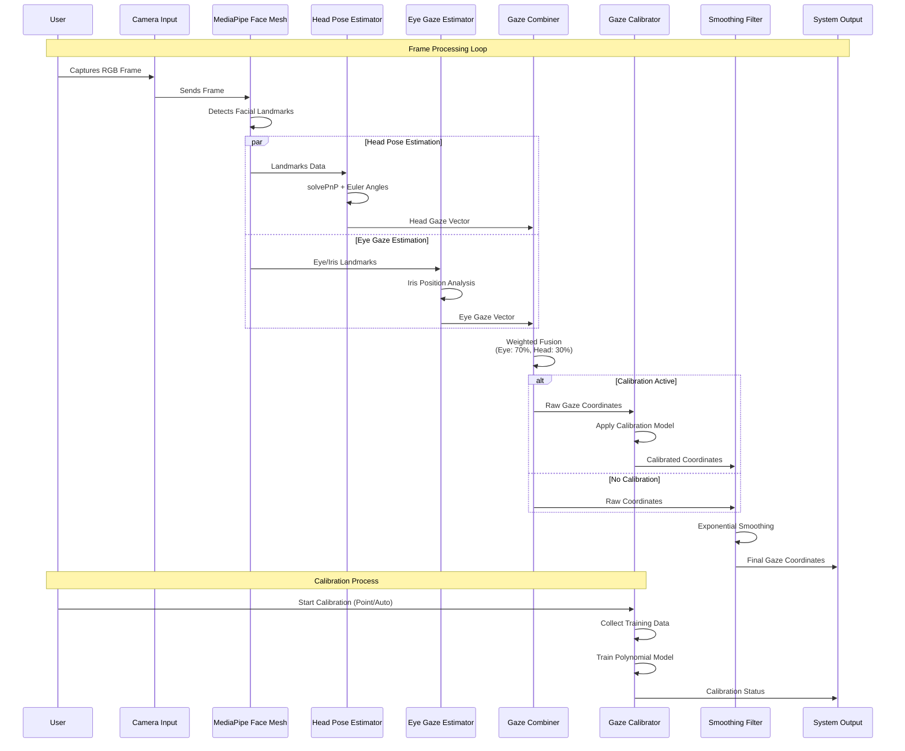

```mermaid
sequenceDiagram
    participant User
    participant Camera as Camera Input
    participant MediaPipe as MediaPipe Face Mesh
    participant HeadPose as Head Pose Estimator
    participant EyeGaze as Eye Gaze Estimator
    participant Combiner as Gaze Combiner
    participant Calibrator as Gaze Calibrator
    participant Smoother as Smoothing Filter
    participant Output as System Output

    Note over User,Output: Frame Processing Loop

    User->>Camera: Captures RGB Frame
    Camera->>MediaPipe: Sends Frame
    MediaPipe->>MediaPipe: Detects Facial Landmarks

    par Head Pose Estimation
        MediaPipe->>HeadPose: Landmarks Data
        HeadPose->>HeadPose: solvePnP + Euler Angles
        HeadPose->>Combiner: Head Gaze Vector
    and Eye Gaze Estimation
        MediaPipe->>EyeGaze: Eye/Iris Landmarks
        EyeGaze->>EyeGaze: Iris Position Analysis
        EyeGaze->>Combiner: Eye Gaze Vector
    end

    Combiner->>Combiner: Weighted Fusion<br/>(Eye: 70%, Head: 30%)

    alt Calibration Active
        Combiner->>Calibrator: Raw Gaze Coordinates
        Calibrator->>Calibrator: Apply Calibration Model
        Calibrator->>Smoother: Calibrated Coordinates
    else No Calibration
        Combiner->>Smoother: Raw Coordinates
    end

    Smoother->>Smoother: Exponential Smoothing
    Smoother->>Output: Final Gaze Coordinates

    Note over Calibrator,User: Calibration Process
    User->>Calibrator: Start Calibration (Point/Auto)
    Calibrator->>Calibrator: Collect Training Data
    Calibrator->>Calibrator: Train Polynomial Model
    Calibrator->>Output: Calibration Status
```
